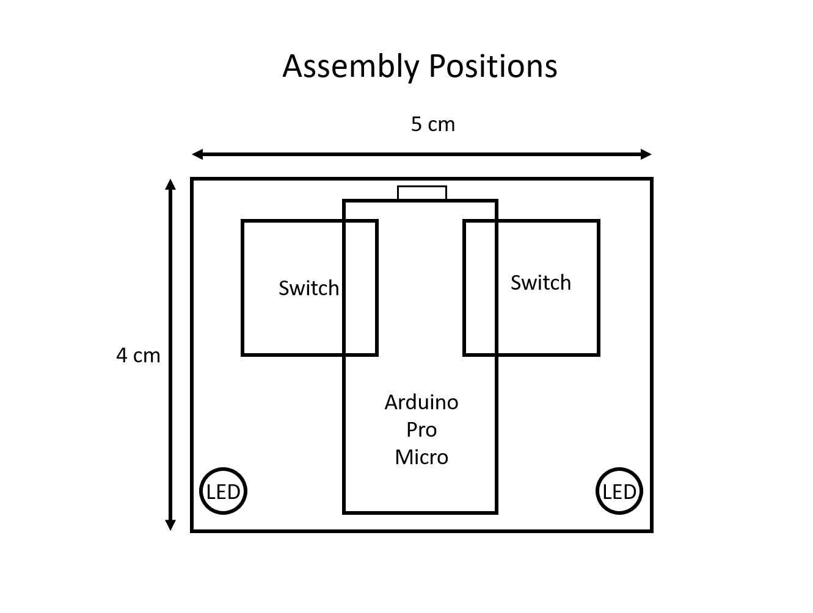

# OsuPad
A 2k keypad for osu!, I made this keypad with my dad for a New Years gift.
This repository will tell you every step in the process of making this.
 
 ### Prepare Stuff
  * 4x 4 cm x 5 cm Acrylic
  * 2x Keyboard switches
  * 2x Keycaps
  * 1x Arduino Pro Micro
  * 2x Short wires
  * 1x Keychain rope
  * 2x LEDs

### Prepare Acrylic
Prepare your 4 plates of acrylic.
 * On the first plate, we cut 2 square holes for switches.
 * On the second and third plate, cut a square hole for the Arduino board and 2 holes left and right for the switch pins.
 * For the fourth plate, will be used as a base so we don't need to cut it.
 * Then we drill 2 holes for all plates on bottom-left and bottom-right for LEDs.

   

### Assembly
 * Put all the switches on the first plate and put the Arduino board on the bottom of the plate by switch pins connecting to pinout 3 and A3.
 * Put the secound and third plate on bottom of first plate than glue it.
 * Put all LEDs in the holes.
 * Connect them with the wires by following the [picture](Images/Assembly.png) below.
 * Put the fourth plate then glue it.

   

   

### Decorating
 * Chamfer all edges with grinding machine.
 * Use a sandpaper scrub all sides

### Coding
 * Open Arduino.
 * Open the project folder.
 * Select the board by go to (Tools -> Board).
 * Upload your code to board.

### Testing
It's working nicely but the LEDs are too bright because I forgot to add resistors.\
Overall it's a good keypad.\
[Testing prototype 1](https://youtu.be/cbt6duyYUWE)

 
 
 
 ## All pictures
 ### Prototype 1

   

### Assembly Positions

   

### Assembly

   

### Writing Diagram

   

